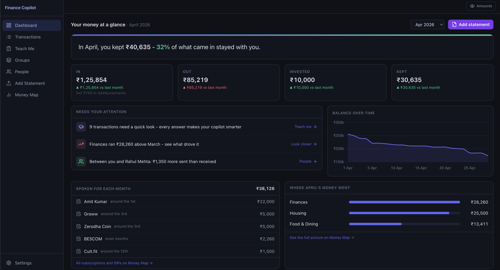
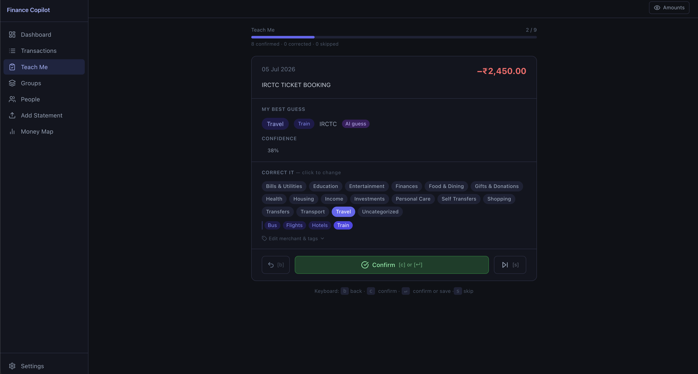
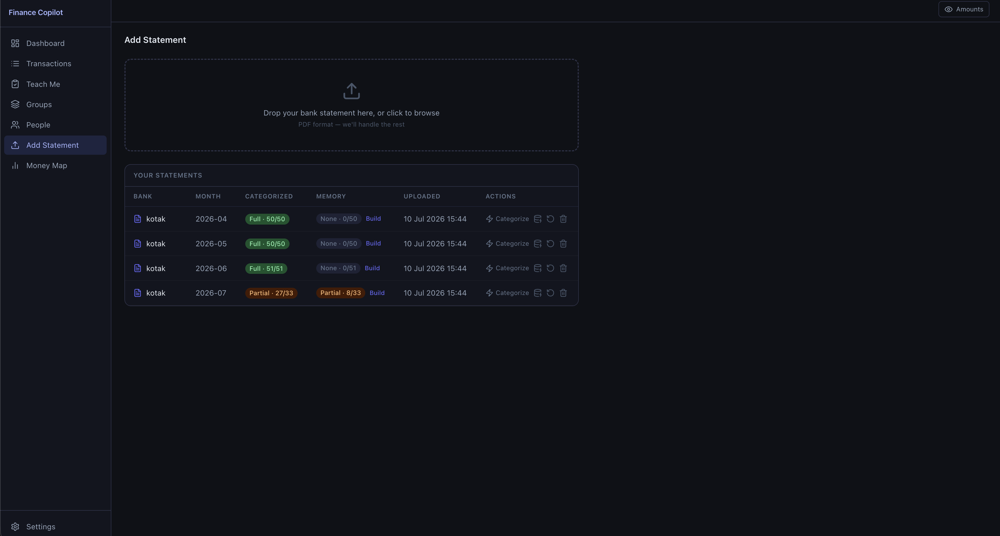
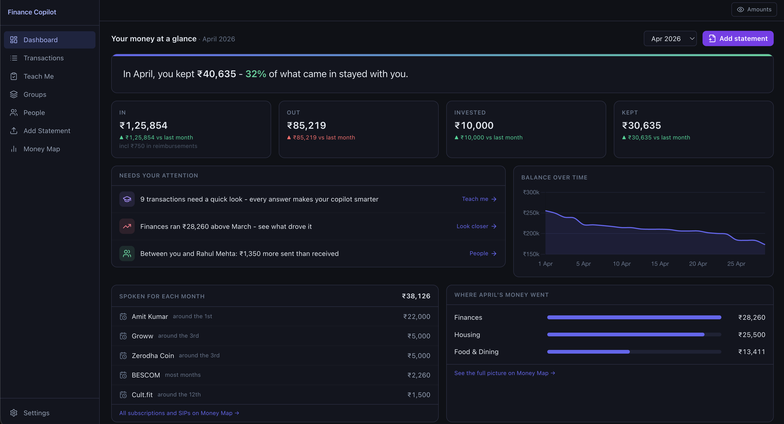
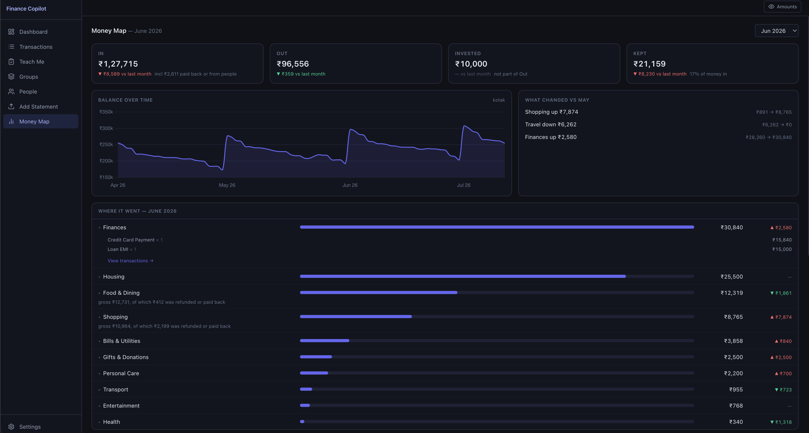
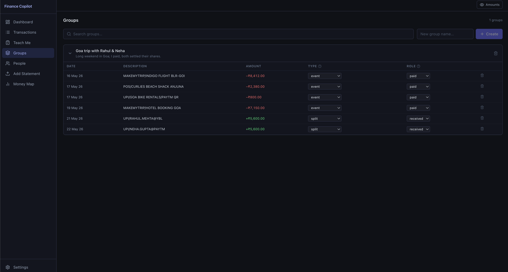

# Finance Copilot

Personal finance tool that auto-categorizes bank transactions using a multi-stage pipeline of rules, RAG, and LLM. Powered entirely by Ollama, with no cloud services, no API costs, and full privacy.


## Highlights

- **100% local** - SQLite database + Ollama for inference, everything stays on your machine
- **Multi-stage annotation pipeline** - Rules > RAG Direct > RAG Prompted > Plain LLM, with graceful fallbacks
- **Human-in-the-loop** - Low-confidence predictions surface in an intuitive and fast review queue for correction
- **Bank statement parsing** - Dedicated Kotak parser plus a generic parser that handles most banks' tabular statement PDFs, with every row verified against the running balance; UPI metadata extracted automatically
- **Vector similarity search** - sqlite-vec powers few-shot retrieval for better categorization over time
- **React dashboard** - Transaction management, annotation review, expense groups, and insights/charts

## How the Pipeline Works

When you trigger auto-annotation, each transaction flows through four stages. The first match wins:

```
Transaction
    |
    v
[Stage 1: Rules]          - Known-person match (UPI handle from people table),
    |  confidence: 0.95       then merchant keywords & UPI notes (~70 built-in rules)
    |  no match? ↓
    v
[Stage 2: RAG Direct]     - Find top-5 similar annotated transactions via embeddings
    |  confidence: dynamic    If best match similarity >= 0.92 and donor is trusted,
    |                         copy annotation (cosine × agreement × margin factors)
    |  no match? ↓
    v
[Stage 3: RAG Prompted]   - Few-shot LLM call with retrieved examples as context
    |  confidence: dynamic    llm_conf × calibrated dampening (base 0.92, adapts with feedback)
    |  no match? ↓
    v
[Stage 4: Plain LLM]      - Cold LLM call without examples
    |  confidence: dynamic    llm_conf × calibrated dampening (base 0.85, adapts with feedback)
    v
 Annotation saved → below threshold (0.85)? → Review Queue
```

Confidence dampening for Stages 3 and 4 uses Bayesian calibration, starting from static base values but dynamically adjusting per `(source, category)` as human feedback (confirmations, corrections) accumulates.

See [`docs/annotation-pipeline.md`](docs/annotation-pipeline.md) for the full Mermaid flowchart.

## Tech Stack

| Layer | Technology |
|-------|-----------|
| Backend | FastAPI (async Python), Pydantic v2 |
| Frontend | React 18, React Router, Vite |
| Styling | Tailwind CSS, Lucide React icons |
| Database | SQLite + sqlite-vec (vectors in the same DB file) |
| LLM | Ollama — qwen3.5:4b (inference), nomic-embed-text (embeddings) |
| PDF Parsing | pdfplumber |
| Charts | Chart.js + react-chartjs-2 |
| CLI | Typer + Rich (terminal review queue) |
| IDs | ULID (sortable, unique) |

## Getting Started

### Prerequisites

- Python 3.10+
- Node.js 18+
- [Ollama](https://ollama.com) installed and running

Pull the required models:

```bash
ollama pull qwen3.5:4b
ollama pull nomic-embed-text
```

### Backend

```bash
# Install dependencies (creates .venv from pyproject.toml + uv.lock)
uv sync

# Start the API server (runs migrations automatically on startup)
# Binds to 127.0.0.1 by default — loopback only, so your statements are not
# exposed on the network. Set RELOAD=1 for auto-reload during development.
RELOAD=1 uv run python -m src
```

> The server binds to `127.0.0.1` by default. It has no authentication yet, so
> only expose it on your LAN deliberately: set `HOST=0.0.0.0` (you will get a
> startup warning). `PORT` defaults to `8000`.

### Frontend

```bash
cd ui
npm install
npm run dev      # Dev server at http://localhost:5173 (proxies API to :8000)
npm run build    # Production build → ui/dist/ (served by FastAPI)
```

### Environment Variables

Create a `.env` file in the project root:

```env
DB_PATH=data/finance.db
OLLAMA_URL=http://localhost:11434
OLLAMA_MODEL=qwen3.5:4b
OLLAMA_EMBEDDING_MODEL=nomic-embed-text
CONFIDENCE_THRESHOLD=0.85
```

For password-protected statement PDFs, enter the password in the upload form — it is sent with the upload request, not stored.

All values have sensible defaults in `src/config.py` — the `.env` file is optional unless you need to override them.

### CLI Review Queue

```bash
uv run python -m src.cli review
```

Interactive terminal UI for reviewing and correcting low-confidence annotations.

## Project Structure

```
src/
├── api/routes/          # FastAPI endpoints (statements, transactions, annotations, ...)
├── db/
│   ├── migrations/      # Versioned SQL migrations (applied once, tracked in schema_migrations)
│   └── queries/         # SQL query builders
├── models/              # Pydantic schemas
├── parsers/
│   └── banks/           # Bank-specific PDF parsers (kotak.py)
├── pipeline/            # Annotation engine (rules, embed, annotate, llm, calibration)
├── config.py            # All settings (Pydantic BaseSettings, reads .env)
├── cli.py               # Typer CLI for terminal review
└── main.py              # FastAPI app entry point

ui/
├── src/
│   ├── pages/           # Dashboard, ReviewQueue, Transactions, Upload, Groups, People, Insights
│   ├── components/      # AnnotationPanel, CategoryPicker, TransactionTable, TagInput, ...
│   ├── contexts/        # StatementContext, ToastContext
│   └── lib/api.js       # HTTP client wrapper
└── vite.config.js

data/                    # SQLite database (gitignored)
docs/                    # Pipeline documentation
```

## Demo Data

Seed the database with 50 synthetic transactions (entirely fictional) to explore the UI without uploading real bank statements:

```bash
uv run python scripts/seed_demo_data.py          # seed transactions, annotations, and people
uv run python scripts/seed_demo_data.py --wipe    # remove demo data
```

The demo data includes:
- Pre-annotated transactions from all pipeline stages (rule, rag_direct, rag_prompted, llm, manual)
- Low-confidence annotations that appear in the review queue
- Unannotated transactions ready for auto-annotate
- Synthetic people for known-person matching

After seeding, start the server and trigger auto-annotate on the remaining unannotated transactions to see the full pipeline in action.

## Bank Statement Parsing

Uploads are auto-detected by the parser registry (`src/parsers/registry.py`):

1. **Dedicated parsers** (currently Kotak) are tried first.
2. The **generic parser** (`src/parsers/generic.py`) handles everything else: it
   extracts tables from the PDF, infers which columns are date / description /
   debit / credit / balance from the header row, and then **verifies every row
   arithmetically against the running balance** (`balance[i] == balance[i-1] ± amount`).
   It only claims a statement when ≥80% of those checks pass, so it cannot
   silently ingest wrong amounts — unsupported layouts are rejected with an error
   instead.

Limitations of the generic parser: it needs a text-native PDF (no scans/OCR), a
tabular layout with a header row, and a running-balance column (so most savings
account statements work; credit-card statements generally won't yet).

### Adding a Dedicated Bank Parser

Only needed when the generic parser can't handle a bank's layout:

1. Create a new file under `src/parsers/banks/` (e.g., `sbi.py`)
2. Subclass `StatementParser` from `src/parsers/base.py`
3. Implement the `parse()` method to extract transactions from the PDF
4. Register it in `src/parsers/registry.py` **before** `GenericStatementParser`

## Demo Screenshots

### Dashboard

*Transaction overview with auto-annotate trigger and confidence scores*

### Review Queue

*Low-confidence annotations surfaced for human correction*

### Upload & Parse

*Drag-and-drop PDF upload with bank auto-detection*

### Transactions

*Full transaction table with category chips, inline editing, and filters*

### Insights

*Spending breakdowns and trends*

### Groups

*Group shared expenses (trips, events) and track who paid vs. who settled their split*

### People

*Known counterparties with UPI handles and relationships, so transfers get categorized correctly*

## Testing

```bash
uv run pytest src/tests/
```
