# Auto-Annotation Pipeline

```mermaid
flowchart TD
    START(["`**auto_annotate** called
    statement_id / transaction_ids`"])
    LOAD[Load transactions from DB]
    SKIP{Already annotated?}
    SKIP_OUT([Skip — already_annotated++])

    START --> LOAD --> SKIP
    SKIP -->|yes| SKIP_OUT
    SKIP -->|no| S1

    subgraph S1["Stage 1 — Rules"]
        direction TB
        R0["`For each unannotated txn
        try **_match_known_person(txn)**`"]
        R0Y(["`Persist annotation
        source=rule · category=Transfers/Peer Transfer
        confidence=0.95`"])
        R1["`run **apply_rules(txn)**`"]
        R2{"`**Phase 1:** Disambiguation rule match?
        base_pattern AND override_pattern`"}
        R3{"`**Phase 2:** Merchant rule match?
        any pattern in raw_description / upi_note`"}
        R4(["`Persist annotation
        source=rule · confidence=0.95`"])
        R5[Push to needs_rag]

        R0 -->|match — known person in description| R0Y
        R0 -->|no match| R1
        R1 --> R2
        R2 -->|yes — more specific match| R4
        R2 -->|no| R3
        R3 -->|yes| R4
        R3 -->|no| R5
    end

    subgraph S23["Stages 2 + 3 — RAG"]
        direction TB
        EMB["`**build_embed_text(txn)**
        get_embedding_single() → query vector`"]
        EMB_FAIL(["`Embedding service down
        → fall through to Stage 4`"])
        FIND["`**find_similar()**
        top_k=5, exclude self`"]
        NO_SIM(["`No similar found
        → fall through to Stage 4`"])
        FLOOR{"`best_similarity
        ≥ rag_similarity_floor (0.65)?`"}
        FLOOR_FAIL(["`Novelty gate triggered
        → fall through to Stage 4`"])
        FETCH["`Fetch annotations for all top-K matches
        build annotated_matches list`"]

        subgraph S2["Stage 2 — RAG Direct"]
            direction TB
            D1{"`cosine_similarity
            ≥ rag_direct_threshold (0.92)?`"}
            D2{"`donor annotation exists
            AND source in trusted?
            {manual, rule, imported}`"}
            D3["`Compute agreement_factor
            majority_fraction ^ 0.3`"]
            D4["`Compute margin_factor
            linear interp 0.85→1.0
            based on gap to nearest diff-category`"]
            D5["`confidence =
            cosine_sim × agreement × margin`"]
            D6(["`Persist annotation
            source=rag_direct`"])
            D_SKIP(["`Donor untrusted (llm/rag)
            → fall through to Stage 3`"])

            D1 -->|yes| D2
            D2 -->|yes| D3 --> D4 --> D5 --> D6
            D2 -->|no — untrusted source| D_SKIP
            D1 -->|no — below threshold| S3
        end

        subgraph S3["Stage 3 — RAG Prompted"]
            direction TB
            P1["`**_build_examples_from_similar()**
            fetch txn + annotation for each match
            sort: manual → rule → imported → llm/rag`"]
            P2{Examples found?}
            P3["`**annotate_transaction_llm_with_examples()**
            system prompt + few-shot examples + txn`"]
            P4["`confidence =
            llm_conf × calibrated_dampen(rag_prompted, category)
            base 0.92, shifts with feedback`"]
            P4B["`off-example cap / defer band
            (see Confidence Scoring Summary)`"]
            P4C["`**_fuse_counterparty_prior()**
            recurrence prior agrees → rescue
            disagrees → tighten · else neutral`"]
            P5(["`Persist annotation
            source=rag_prompted`"])
            P_FAIL(["`LLM returned nothing
            → fall through to Stage 4`"])

            P1 --> P2
            P2 -->|yes| P3 --> P4 --> P4B --> P4C --> P5
            P2 -->|no| P_FAIL
            P3 -->|LLM failed| P_FAIL
        end

        EMB -->|failed| EMB_FAIL
        EMB -->|ok| FIND
        FIND -->|empty| NO_SIM
        FIND -->|results| FLOOR
        FLOOR -->|no| FLOOR_FAIL
        FLOOR -->|yes| FETCH --> D1
        D_SKIP --> S3
    end

    subgraph S4["Stage 4 — Plain LLM"]
        direction TB
        L1["`**annotate_transaction_llm()**
        system prompt + txn only, no examples`"]
        L2["`confidence =
        llm_conf × calibrated_dampen(llm, category)
        base 0.85, shifts with feedback`"]
        L3(["`Persist annotation
        source=llm`"])
        L_FAIL(["`All retries failed
        llm_failed++`"])

        L1 --> L2 --> L3
        L1 -->|failed after retries| L_FAIL
    end

    R5 --> EMB
    EMB_FAIL --> S4
    NO_SIM --> S4
    FLOOR_FAIL --> S4
    P_FAIL --> S4
    D_SKIP -.->|if no examples| S4

    subgraph CONF["Confidence Scoring Summary"]
        direction LR
        C1("`**rule:** 0.95 fixed`")
        C2("`**rag_direct:** cosine × agreement × margin
        e.g. 0.95 × 0.93 × 0.96 ≈ 0.849`")
        C3("`**rag_prompted:** llm_conf × calibrated_dampen(rag_prompted, category)
        base 0.92, adjusted by feedback`")
        C4("`**llm:** llm_conf × calibrated_dampen(llm, category)
        base 0.85, adjusted by feedback`")
    end

    RESULT(["`**AutoAnnotateResult**
    rule_matched · rag_direct_annotated
    rag_prompted_annotated · llm_annotated
    llm_failed · low_confidence · already_annotated`"])

    D6 --> RESULT
    P5 --> RESULT
    L3 --> RESULT
    L_FAIL --> RESULT
    SKIP_OUT --> RESULT
```

## Stage Summary

| Stage | Source tag | Trigger | Confidence formula |
|---|---|---|---|
| 1 — Rules | `rule` | Known-person match (UPI handle in `people` table), or keyword/merchant match in raw_description / upi_note | Fixed **0.95** |
| 2 — RAG Direct | `rag_direct` | cosine_similarity ≥ 0.92 AND donor is trusted source (`manual`, `rule`, `imported`) | `cosine × agreement_factor × margin_factor` |
| 3 — RAG Prompted | `rag_prompted` | cosine_similarity found but < 0.92, donor untrusted, or no annotation on top match | `llm_conf × calibrated_dampen(rag_prompted, category)`, then off-example cap / defer band / counterparty prior |
| 4 — Plain LLM | `llm` | No embeddings, novelty gate triggered, or RAG found nothing | `llm_conf × calibrated_dampen(llm, category)` |

## Key Thresholds (all configurable via env)

| Setting | Default | Purpose |
|---|---|---|
| `rag_similarity_floor` | 0.65 | Novelty gate — below this, RAG examples are noise |
| `rag_direct_threshold` | 0.92 | Minimum similarity to copy annotation directly |
| `rag_top_k` | 5 | Number of similar transactions to retrieve |
| `rag_agreement_exponent` | 0.3 | Controls harshness of category disagreement penalty |
| `rag_margin_safe` | 0.08 | Distance gap above which margin factor = 1.0 (no penalty) |
| `llm_confidence_dampen` | 0.85 | Base dampening for plain LLM confidence (Beta prior) |
| `llm_confidence_dampen_rag` | 0.92 | Base dampening for RAG-prompted LLM confidence (Beta prior) |
| `confidence_threshold` | 0.85 | Below this → flagged for human review |
| `rag_offexample_confidence_cap` | 0.5 | Cap when rag_prompted picks a category absent from all retrieved examples |
| `rag_consensus_floor` | 0.6 | Trusted-vote winning share below this → defer band may fire |
| `rag_defer_confidence_cap` | 0.5 | Cap applied by the defer band (and counterparty "tighten") |
| `counterparty_prior_enabled` | true | Master switch for the counterparty recurrence prior |
| `counterparty_min_observations` | 2 | Min prior txns to a counterparty before its prior can influence routing |
| `counterparty_dominance_floor` | 0.65 | Shrunk P(category·counterparty) needed for the prior to count as established |
| `counterparty_prior_weight` | 2.0 | Empirical-Bayes pseudo-count; higher = more evidence before history dominates |

## Bayesian Confidence Calibration

Stages 3 and 4 use dynamic dampening instead of fixed multipliers. The dampening factor for each `(source, category)` pair is modelled as a Beta distribution:

- **Prior:** Derived from the static setting (`0.85` or `0.92`) with 5 pseudo-observations
- **Updates:** Human feedback shifts the distribution:
  - Confirmation → alpha + 1
  - Refinement (minor edit) → alpha + 0.5
  - Correction (category change) → beta + 1
- **Result:** `dampening = alpha / (alpha + beta)`

With zero feedback the dampening equals the static setting exactly. As confirmations accumulate for a category, dampening rises toward 1.0; corrections push it down.

See `src/pipeline/calibration.py` for the implementation.

## Counterparty Recurrence Prior (rag_prompted)

The embedding/KNN retriever is blind to *recurrence*: a payment to a recurring contact and one to a random cab driver are both "a UPI to a personal name", so the neighbour vote is dominated by base rates. But the user's own history separates them — cab counterparties are one-and-done (~1.06 txns each) while family/friends recur (~4.2x). This signal is computed **out-of-band** and **late-fused** into the rag_prompted confidence, after the off-example/defer caps and **without ever changing the label**.

- **Identity:** `upper(trim())` of the UPI name segment (2nd `/`-field of `UPI/NAME/ref/note`). The bank format carries no VPA (≈1/568 rows), so the name segment is the only stable counterparty handle. Consistent truncation means an entity collides with itself; the only failure mode is *false-split* (one entity seen as two), which merely under-counts recurrence — never over-merges two people.
- **Empirical-Bayes shrinkage (uninformed prior):** `P(c·cp) = (m·base + w_c) / (m + W)` over the counterparty's *prior* labels only (causal: bounded by the txn's date, excludes self; trusted sources full weight, machine guesses downweighted). At `W=0` the prior is **inert** — a new user or first-time counterparty behaves exactly as before. The prior can only sharpen, never skew (cold-start safe).
- **Fusion (`_fuse_counterparty_prior`):** only when the prior is *established* (`n ≥ counterparty_min_observations` and `P ≥ counterparty_dominance_floor`):
  - **agrees** with the chosen label → **rescue**: lift confidence toward `P` (recovers genuine recurring transfers that category-level calibration over-punishes).
  - **disagrees** → **tighten**: cap to `rag_defer_confidence_cap` → routes to review (catches both a cab-misfire and a recurring contact's occasional off-category spend).
  - otherwise → **neutral** (no change).

The dev-mode reasoning trace records `counterparty_prior_category / _probability / _n / _effect`. Tuned on the Dec–Mar 2026 causal backtest (`scripts/backtest_counterparty_prior.py --sweep`): `min_observations=2`, `dominance_floor=0.65`. The prior only helps *recurring* counterparties — one-off personal names get no nudge by design.

See `src/pipeline/counterparty.py` for the implementation.

## Embedding Text (recurring-merchant retrieval)

`build_embed_text` (`src/pipeline/embed.py`) deliberately **excludes the raw amount and the rotating UPI reference number**. UPI descriptions are `UPI/<merchant>/<numeric-ref>/<note>`, and that 12-ish-digit ref is unique per transaction — leaving it (or the amount) in the embedded string makes two visits to the *same* merchant embed as only ~0.6–0.9 similar instead of ~1.0. That drops recurring merchants below `rag_similarity_floor` (0.65), the novelty gate discards the correct same-merchant donors, and the txn falls through to plain Stage-4 LLM with no examples (the "description lacks context" failure → confidence crushed to ~0.14).

`normalize_description_for_embedding` strips only the numeric ref segment of a `UPI/...` description, keeps the merchant and any meaningful trailing note (e.g. `movie tickets`), drops the boilerplate `UPI` note, and leaves non-UPI descriptions (NEFT/PCD/VISA/plain text) untouched. After this change two visits to `OBEROIFC tucksh` embed identically (similarity 1.0), clearing both the novelty gate and the `rag_direct` threshold. **Changing this function invalidates the stored vector space** — re-embed all transactions (`scripts/reembed_all.py`) and re-annotate afterward.

## Person-History Gate (stage 1)

The known-person rule labels by *mechanism* (payment to a known person → Transfers/Peer Transfer, 0.95) while humans label by *purpose* (the same payment can be Entertainment when it settles a shared expense).
`rule_annotation` therefore checks the person's counterparty prior: when an established prior contradicts the rule's category, confidence is capped to `rag_defer_confidence_cap` so the transaction routes to review.
The label is never changed and cold start is unaffected.
Eval note (e6, 2026-07-03): null on current data - wrong person-rule labels come from Transfers-dominant contacts' occasional purpose payments, which history cannot predict - but the gate is free and catches future non-transfer-dominant "people".

## Learned Merchant Memory (stage 1.5)

Between the hand-authored rules (stage 1) and RAG (stage 2), a counterparty the user has verified enough times gets a deterministic label with no embedding or LLM call.
A merchant is *promoted* when it has >= `learned_rule_min_support` (3) human-verified labels (`manual`/`imported` only - machine sources never promote, so a recurring mislabel can't bootstrap itself) for its modal category at >= `learned_rule_purity` (0.9) purity; the label copies the most recent verified annotation's category/subcategory/merchant/tags at `learned_rule_confidence` (0.95), `source=learned_rule`.

Rules are **computed on-demand** from the annotations table (indexed by `counterparty_key`), not materialized: single source of truth, no staleness, automatic demotion (a correction lowers purity on the next lookup), and identical code in production and the causal eval (`before_txn_date` bounds it to labels older than the scored transaction).
Personal counterparties are handled by the stage-1 person rule and never reach here; the purity bar blocks mixed-purpose names.
`GET /api/annotations/learned-rules` lists the currently-established rules for transparency; correcting a transaction is how a user retires or changes one.
Gated by `learned_rule_enabled` (on by default since 2026-07-03: clean-DB eval showed accuracy-neutral, better Brier/auto-accept/latency, 21/234 recurring merchants labeled deterministically at 100% causal precision).

## Apply-to-Similar (correction propagation)

After a correction in the review queue, `GET /api/annotations/{id}/similar` returns machine-labeled neighbours (cosine ≥ `apply_similar_floor` (0.9) or same `counterparty_key`), and `POST .../apply-to-similar` copies the corrected label onto the user-selected subset.
Human-sourced annotations are never offered for overwriting; each applied target records feedback against its original machine source and flips to `manual` with `original_source` preserved.
This is the main accuracy lever: retrieval stages are 96-100% accurate when they fire, so quality grows by feeding them corrected donors.

## BYOM Provider

`llm_provider` selects the LLM backend behind a single code path (`src/pipeline/llm.py`): `ollama` (default, native API with grammar-constrained output and logprob confidence), `openai` (any OpenAI-compatible `/chat/completions` endpoint - LM Studio, vLLM, OpenRouter, OpenAI - via `llm_base_url`/`llm_api_key`/`llm_model`, using `response_format: json_schema`), or `none` (AI disabled: the pipeline degrades to rules + RAG-direct and routes the rest to review).

## Evaluation

`scripts/build_golden.py` exports all manual annotations; `scripts/eval.py --name <run>` replays the full cascade with time-split retrieval (donors strictly older than each transaction) and writes per-stage accuracy, Brier, auto-accept precision, and failure lists to `eval/results/`.
`scripts/eval_diff.py <a> <b>` compares two runs and exits non-zero on regression - run it before landing any pipeline change.

## LLM Determinism

Annotation is a deterministic classification task, so the Ollama calls run with `temperature: 0` and a fixed `seed` (`src/pipeline/llm.py`). This matters beyond reproducibility: at the default temperature (~0.8) a small model intermittently emits **malformed JSON in the free-text `reasoning` field** (escaped/single quotes, stray braces, or truncation), which fails schema validation, triggers retries, and silently degrades the label. With `temperature: 0`, re-annotating the same transactions is stable run-to-run (verified 19/19 stable, 0 validation errors via `scripts/diff_reannotate_april.py`). `num_predict` gives the reasoning sentence headroom to avoid mid-string truncation. The `reasoning` field is **truncated, not rejected**, when it exceeds 160 chars (a `field_validator` in `AnnotationResponse`): a slightly-too-long sentence from a small model must never drop an otherwise-valid classification.
