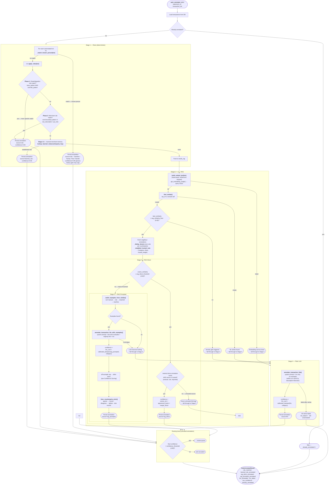

# Auto-Annotation Pipeline

The pipeline is a **cost-ordered cascade**: cheap deterministic stages run first, and a transaction only falls through to a more expensive stage when the cheaper ones cannot confidently label it.
The LLM is the *fallback*, not the primary path.
Every stage writes a full reasoning trace, so any decision can be explained after the fact.

Entry point: `auto_annotate` in [`src/pipeline/annotate.py`](../src/pipeline/annotate.py).



## Stage Summary

| Stage | Source tag | Trigger | Confidence formula |
|---|---|---|---|
| 1 — Rules | `rule` | Known-person match (people table), or word-boundary keyword/merchant match | Fixed **0.95** (person-history gate may cap) |
| 1.5 — Learned merchant memory | `learned_rule` | Counterparty has ≥ 3 human-verified labels for its modal category at ≥ 0.9 purity | Fixed **0.95** |
| 2 — RAG Direct | `rag_direct` | cosine ≥ 0.92 AND nearest donor is trusted (`manual`/`rule`/`imported`) | `cosine × agreement × margin` |
| 3 — RAG Prompted | `rag_prompted` | Similar found but Stage 2 didn't fire (below 0.92, or donor untrusted) | `llm_conf × dampen(rag_prompted, category)`, then off-example cap / defer band / counterparty prior |
| 4 — Plain LLM | `llm` | No embeddings, novelty gate tripped, or RAG found nothing | `llm_conf × dampen(llm, category)` |

## Key Thresholds (all configurable via env — see `src/config.py`)

| Setting | Default | Purpose |
|---|---|---|
| `confidence_threshold` | 0.85 | Below this → routed to human review |
| `rag_top_k` | 5 | Number of similar transactions retrieved |
| `rag_similarity_floor` | 0.65 | Novelty gate — below this, RAG examples are noise → Stage 4 |
| `rag_direct_threshold` | 0.92 | Minimum similarity to copy an annotation directly |
| `rag_agreement_exponent` | 0.3 | Harshness of the category-disagreement penalty (`majority_fraction ** exp`) |
| `rag_margin_safe` | 0.08 | Distance gap above which margin factor = 1.0 (no penalty) |
| `rag_machine_donor_weight` | 0.25 | Vote weight of a machine donor (`llm`/`rag_*`) vs a trusted donor (1.0) |
| `llm_confidence_dampen` | 0.85 | Beta-prior base for plain-LLM confidence |
| `llm_confidence_dampen_rag` | 0.92 | Beta-prior base for RAG-prompted confidence |
| `rag_offexample_confidence_cap` | 0.5 | Cap when rag_prompted picks a category absent from all retrieved examples |
| `rag_consensus_floor` | 0.6 | Trusted-vote winning share below this → defer band may fire |
| `rag_defer_llm_confidence` | 0.85 | Defer band only fires when the LLM's own confidence is below this |
| `rag_defer_confidence_cap` | 0.5 | Cap applied by the defer band, counterparty "tighten", and the person-history gate |
| `counterparty_prior_enabled` | true | Master switch for the counterparty recurrence prior |
| `counterparty_min_observations` | 2 | Min prior txns to a counterparty before its prior can influence routing |
| `counterparty_dominance_floor` | 0.65 | Shrunk P(category·counterparty) needed for the prior to count as established |
| `counterparty_prior_weight` | 2.0 | Empirical-Bayes pseudo-count; higher = more evidence before history dominates |
| `learned_rule_enabled` | true | Master switch for stage 1.5 |
| `learned_rule_min_support` | 3 | Human-verified labels for the modal category needed to promote a merchant |
| `learned_rule_purity` | 0.9 | Minimum purity (support / total) to promote |
| `learned_rule_confidence` | 0.95 | Confidence assigned to a learned-rule label |
| `llm_logprob_confidence` | true | Use token-logprob mass on the category as confidence instead of the verbalized number |

## Reasoning Traces (always on)

Every stage builds a `ReasoningTrace` and `_persist` **always** serializes it into `annotations.reasoning` — the routing trail (`skips`), the deduped neighbours with their similarities, the donor vote, the thresholds each measured value was compared against, the embed text, the few-shot examples, LLM telemetry, and raw-vs-dampened confidence.
`DEV_MODE` only gates the *surface*: when on, the API returns the trace and the UI shows the "Why this annotation?" panel.
Because traces are captured unconditionally, flipping dev mode on later still explains past decisions (test: `test_trace_captured_even_with_dev_mode_off`).

A real `rag_prompted` trace (a monthly salary credit whose bank reference rotates, so it never matches exactly):

```
raw_description: IFT- AIRISE CYBERSECURITY PRI-FCM- 260430MOF3UM
embed_text:      credit ift- airise cybersecurity pri-fcm- 260430mof3um
best_similarity: 0.8211            (< 0.92 → not rag_direct)
neighbours:      2× prior "AIRISE CYBERSECURITY" credits, both manual → Income
vote_category:   Income   vote_share: 1.0   trusted_weight: 2.0
majority_category: Income (5 of 5 examples)
raw_confidence:  0.9993 (logprob)  dampening: 0.9333
final_confidence: 0.9327 → auto-accepted   caps_applied: []
llm_reasoning:   "This transaction matches the exact merchant and credit direction of previous examples..."
```

## Stage 1 — Rules

`rule_annotation` runs three sub-steps in order: known-person match → keyword/merchant rules (`apply_rules`) → learned merchant memory (stage 1.5).

### Known-person match and the person-history gate

`_match_known_person` matches a transaction against the `people` table.
Match tokens are shape-aware (`_person_token_matches`): a VPA token (`name@bank`) requires exact VPA equality; a name token is a word-*prefix* match against the `counterparty_key` (so `karabi` matches `KARABI BORA` but a short token can't fire as a bare substring of an unrelated merchant).
On a match the label is `Transfers`, and the **relationship drives the subcategory** (`relationship_subcategory`): family relationships (dad/mom/…) → `Transfers › Family`, everything else (including unlabelled) → `Peer Transfer`.

The known-person rule labels by *mechanism* (a payment to a known person → Transfers) while humans label by *purpose* (the same payment can be Entertainment or Food when it settles a shared expense) — on the golden eval it was wrong 10/49 times.
So `rule_annotation` checks the person's counterparty prior: when an *established* prior contradicts the rule's category, confidence is capped to `rag_defer_confidence_cap` (0.5) so the transaction routes to review.
The label is never changed; cold start (no history) keeps the 0.95 fast path.
Eval note (e6, 2026-07-03): null on current data — the wrong person-rule labels come from Transfers-dominant contacts' occasional purpose payments, which history can't predict — but the gate is free and catches future non-transfer-dominant "people".

### Keyword / merchant rules

`apply_rules` runs two phases. **Phase 1** — disambiguation rules (more specific, checked first): a base pattern *and* an override pattern must both match, e.g. `uber`+`eats` → Uber Eats (Food & Dining) instead of the default Uber → Transport; `amazon`+`prime video` → Entertainment; `amazon`+`aws` → Finances.
**Phase 2** — a flat `MERCHANT_RULES` list, first match wins.
Matching uses a **word-boundary regex** (lookarounds, not `\b`, so `d-mart` and `cult.fit` anchor correctly) — this stops `emi` matching inside `premium`.
Each rule matches against `raw_description` + `upi_note` unless it restricts the fields (e.g. `salary` only matches `raw_description`).
Both phases assign a fixed 0.95 and `source="rule"`.

## Learned Merchant Memory (stage 1.5)

Between the hand-authored rules and RAG, a counterparty the user has verified enough times gets a deterministic label with no embedding or LLM call — the recurring, single-purpose bulk of a mature user's statement (SWIGGY, LICIOUS, DISTRICT DINING, …).
A merchant is *promoted* when it has ≥ `learned_rule_min_support` (3) **human-verified** labels (`manual`/`imported` only — machine sources never promote, so a recurring mislabel can't bootstrap itself) for its modal category at ≥ `learned_rule_purity` (0.9) purity.
The label copies the *most recent* verified annotation's category/subcategory/merchant/tags at `learned_rule_confidence` (0.95), `source=learned_rule`.

Rules are **computed on-demand** from the annotations table (indexed by `counterparty_key`), not materialized: single source of truth, no staleness, automatic demotion (a correction lowers purity on the next lookup), and identical code in production and the causal eval (`before_txn_date` bounds it to labels older than the scored transaction).
Personal counterparties are handled by the stage-1 person rule and never reach here; the purity bar blocks mixed-purpose names.

Users can **explicitly dismiss** a learned rule (`learned_rule_suppressions` table via `suppress_learned_rule`): a suppressed key never fires and never shows in the transparency list, and the dismissal is sticky — re-verifying the counterparty does not clear it; the user restores it via `restore_learned_rule`.
`GET /api/annotations/learned-rules` lists the currently-established rules for transparency.
Gated by `learned_rule_enabled` (on by default since 2026-07-03: clean-DB eval showed accuracy-neutral, better Brier/auto-accept/latency, 21/234 recurring merchants labeled deterministically at 100% causal precision).

## Stages 2 + 3 — RAG

### Embedding text (recurring-merchant retrieval)

`build_embed_text` (`src/pipeline/embed.py`) builds `"{direction} {description-without-ref} {upi_note}"`, **lowercased**, and deliberately **excludes the raw amount and the rotating UPI reference number**.
UPI descriptions are `UPI/<merchant>/<numeric-ref>/<note>`, and that 12-ish-digit ref is unique per transaction — leaving it (or the amount) in the embedded string makes two visits to the *same* merchant embed as only ~0.6–0.9 similar instead of ~1.0.
That drops recurring merchants below `rag_similarity_floor` (0.65), the novelty gate discards the correct same-merchant donors, and the txn falls through to plain Stage-4 LLM with no examples (confidence crushed to ~0.14).

`normalize_description_for_embedding` strips only the numeric ref segment of a `UPI/...` description, keeps the merchant and any meaningful trailing note (e.g. `movie tickets`), drops the boilerplate `UPI` note, and leaves non-UPI descriptions untouched.
Lowercasing matters independently: `nomic-embed-text` tokenizes ALL-CAPS bank text into near-meaningless fragments, so distinct uppercase personal-name payees collapse to *identical* embeddings (cosine 1.0); lowercasing recovers normal subword tokens and the names separate (~0.7).
**Changing either function invalidates the stored vector space** — re-embed all transactions (`scripts/reembed_all.py`) and re-annotate afterward.

### Retrieval, dedup, and the weighted vote

`find_similar` queries the `vec_items` sqlite-vec table (cosine distance; similarity = 1 − distance), returning the top-5 neighbours excluding the txn itself.
Two gates follow: no neighbours → Stage 4; novelty gate (`best_similarity < 0.65`) → Stage 4.

Before any decision, the surviving donors are:
- **deduplicated** (`_dedup_donors`) — amount-clustered retrieval often returns the same recurring merchant several times, so donors are grouped by a stable counterparty key (UPI VPA → merchant → normalized description) and only the nearest per group survives (one vote each);
- **voted on with source weighting** (`_weighted_trusted_vote`) — consensus across donors is more reliable than the single nearest neighbour (RankRAG 2024; VoteGCL 2026), and trusted donors (`manual`/`rule`/`imported`) weigh 1.0 while machine guesses weigh `rag_machine_donor_weight` (0.25) so a machine-labelled merchant can't out-vote a human. Returns `(winning_category, winning_share, trusted_weight)`, the basis for confidence and the defer decision.

### Stage 2 — RAG Direct

Fires when `cosine ≥ rag_direct_threshold` (0.92) **and** the nearest donor's source is trusted (an `llm`/`rag_*` donor falls through so the LLM re-evaluates).
It copies the donor's category/subcategory/tags and scores:

```
confidence = cosine_similarity × agreement_factor × margin_factor
```

- **agreement_factor** — 1.0 if all top-K agree on the category, else `majority_fraction ** rag_agreement_exponent` (gentle penalty).
- **margin_factor** — 1.0 if the nearest *different-category* donor is ≥ `rag_margin_safe` (0.08) further away, else linearly interpolated down to 0.85 when tied.

Real trace — `UPI/Taco Bell Obero/...`: two prior manual visits at similarity 1.0, all factors 1.0 → `final_confidence 1.0`, auto-accepted.

### Stage 3 — RAG Prompted

Reached when similarity was found but Stage 2 didn't fire.
The retrieved neighbours become **few-shot examples** injected into the LLM prompt (`_build_examples_from_similar` sorts human-verified examples first — `manual`/`rule`/`imported` before machine — because LLMs are order-sensitive).
The prompt adds a majority hint (*"N of the examples were categorized as X"*) and a guardrail telling the model to prefer a category present in the examples, countering the failure where it ignores the evidence and falls back on its pretraining prior.

Confidence: `llm_conf × get_calibrated_dampening(rag_prompted, category)`, then, in order:
1. **off-example cap** — if the chosen category appears in none of the examples, cap to `rag_offexample_confidence_cap` (0.5) → review (label unchanged);
2. **defer band** — only when the LLM is itself uncertain (`llm_conf < rag_defer_llm_confidence` = 0.85) *and* the trusted donors are split (`vote_share < rag_consensus_floor` = 0.6), cap to `rag_defer_confidence_cap` (0.5) → review;
3. **counterparty prior fusion** (below).

`_normalize_category` / `_normalize_subcategory` validate the LLM output against the taxonomy (exact → case-insensitive → fuzzy for category; drop-to-None for an invented subcategory) as a backstop to the enum-constrained schema.

## Stage 4 — Plain LLM

Reached when RAG produced nothing (embedding down, no neighbours, novelty gate, or rag_prompted's LLM returned nothing).
Same LLM client, txn only, no examples, with a within-run cache keyed by `(normalized description, direction)` so recurring identical descriptions call the LLM once.
Confidence: `llm_conf × get_calibrated_dampening(llm, category)` (base 0.85).
On repeated failure the txn is left unannotated (`llm_failed++`).

Real trace — `UPI/abcoffee/...`: novelty gate tripped (best similarity 0.4611 < 0.65), so plain LLM; the self-descriptive merchant name yields `final_confidence 0.9219`, auto-accepted.

## Bayesian Confidence Calibration

Stages 3 and 4 use dynamic per-`(source, category)` dampening instead of a fixed multiplier (`get_calibrated_dampening`, `src/pipeline/calibration.py`).
The factor is modelled as a Beta distribution:

- **Prior:** derived from the static setting (`0.85` or `0.92`) with 5 pseudo-observations, so with zero feedback `dampening == base` exactly.
- **Updates from human feedback:** confirmation → `alpha + 1`; refinement (minor edit) → `alpha + 0.5`; correction (category change) → `beta + 1`.
- **Result:** `dampening = alpha / (alpha + beta)`.

As confirmations accumulate for a category, dampening rises toward 1.0; corrections push it down.

## Counterparty Recurrence Prior

The embedding/KNN retriever is blind to *recurrence*: a payment to a recurring contact and one to a random cab driver are both "a UPI to a personal name", so the neighbour vote is dominated by base rates.
But the user's own history separates them — cab counterparties are one-and-done (~1.06 txns each) while family/friends recur (~4.2×).
This signal is computed **out-of-band** and **late-fused** into confidence/routing, **without ever changing the label**.
It powers both the Stage-1 person-history gate and the Stage-3 fusion.

- **Identity:** `upper(trim())` of the UPI name segment (2nd `/`-field of `UPI/NAME/ref/note`), stored+indexed as `transactions.counterparty_key` at ingest. Consistent truncation means an entity collides with itself; the only failure mode is *false-split* (one entity seen as two), which merely under-counts recurrence — never over-merges two people.
- **Empirical-Bayes shrinkage (uninformed prior):** `P(c·cp) = (m·base + w_c) / (m + W)` over the counterparty's *prior* labels only (causal: bounded by the txn's date, excludes self; trusted sources full weight, machine guesses downweighted). At `W=0` the prior is **inert** — a new user or first-time counterparty behaves exactly as before.
- **Fusion (`_fuse_counterparty_prior`):** only when the prior is *established* (`n ≥ counterparty_min_observations` and `P ≥ counterparty_dominance_floor`):
  - **agrees** with the chosen label → **rescue**: lift confidence toward `P` (recovers genuine recurring transfers that category-level calibration over-punishes, e.g. KARABI BORA).
  - **disagrees** → **tighten**: cap to `rag_defer_confidence_cap` → routes to review.
  - otherwise → **neutral** (no change).

The reasoning trace records `counterparty_prior_category / _probability / _n / _effect`.
Tuned on the Dec–Mar 2026 causal backtest (`scripts/backtest_counterparty_prior.py --sweep`): `min_observations=2`, `dominance_floor=0.65`.
The prior only helps *recurring* counterparties — one-off personal names get no nudge by design.
See `src/pipeline/counterparty.py`.

## Apply-to-Similar (correction propagation)

After a correction in the review queue, `GET /api/annotations/{id}/similar` returns machine-labeled neighbours (cosine ≥ `apply_similar_floor` (0.9) or same `counterparty_key`), and `POST .../apply-to-similar` copies the corrected label onto the user-selected subset.
Human-sourced annotations are never offered for overwriting; each applied target records feedback against its original machine source and flips to `manual` with `original_source` preserved.
This is the main accuracy lever: retrieval stages are 96–100% accurate when they fire, so quality grows by feeding them corrected donors.

## LLM Client, Providers, and Determinism

The LLM call (`_call_llm`, `src/pipeline/llm.py`) is shared by Stages 3 and 4 and sits behind one provider abstraction (`llm_provider`): `ollama` (default, native `/api/chat` with a grammar-constrained JSON schema and optional logprob confidence), `openai` (any OpenAI-compatible `/chat/completions` endpoint — LM Studio, vLLM, OpenRouter, OpenAI — via `llm_base_url`/`llm_api_key`/`llm_model`, using `response_format: json_schema`), or `none` (AI disabled: the pipeline degrades to rules + RAG-direct and routes the rest to review).

Key parameters, all deliberate:
- **`temperature: 0` + `seed: 42`** — annotation is a deterministic classification task. Beyond reproducibility, at the default temperature (~0.8) a small model intermittently emits malformed JSON in the free-text `reasoning` field (escaped/single quotes, stray braces, truncation), which fails schema validation, triggers retries, and silently degrades the label. With `temperature: 0` re-annotation is stable run-to-run (verified 19/19 stable, 0 validation errors via `scripts/diff_reannotate_april.py`).
- **enum-constrained `category`** — the JSON schema constrains `category` to the actual taxonomy so a small model can't invent "Food" or "Subscriptions"; `_normalize_category` in `annotate.py` is the server-side backstop.
- **`num_predict: 512`** — headroom so the one-sentence `reasoning` doesn't truncate mid-string (which would be invalid JSON).
- **`keep_alive: 30m`** — keeps the 4B model resident; cold-loading costs 5–15 s and runs are bursty.

Robustness: `_strip_code_fence` removes stray ```` ```json ```` fences; `_salvage_dropping_reasoning` recovers the classification by dropping a mangled `reasoning` value before failing; the `reasoning` field is **truncated at 160 chars, not rejected** (`field_validator`), so a slightly-too-long sentence never drops a valid classification; on a parse failure the client does one-shot self-repair (feeds the bad output back asking for corrected JSON), up to 2 retries.

**Confidence signal:** when `llm_logprob_confidence` is on (default), `_logprob_category_confidence` sums the token logprobs over the chosen category's value span and uses `exp(sum)` as a continuous confidence, replacing the coarse verbalized number (adopted 2026-07-02: −9.5% Brier at identical labels). The trace records both `verbalized_confidence` and `logprob_confidence`.

## Evaluation

`scripts/build_golden.py` exports all manual annotations; `scripts/eval.py --name <run>` replays the full cascade with time-split retrieval (donors strictly older than each transaction) and writes per-stage accuracy, Brier, auto-accept precision, and failure lists to `eval/results/`.
`scripts/eval_diff.py <a> <b>` compares two runs and exits non-zero on regression — run it before landing any pipeline change.
