# Auto-Annotation Pipeline

```mermaid
flowchart TD
    START(["`**auto_annotate** called
    statement_id / transaction_ids`"])
    LOAD[Load transactions from DB]
    SKIP{Already annotated?}
    SKIP_OUT([Skip — already_annotated++])

    START --> LOAD --> SKIP
    SKIP -->|yes| SKIP_OUT
    SKIP -->|no| S1

    subgraph S1["Stage 1 — Rules"]
        direction TB
        R0["`For each unannotated txn
        try **_match_known_person(txn)**`"]
        R0Y(["`Persist annotation
        source=rule · category=Transfers/Peer Transfer
        confidence=0.95`"])
        R1["`run **apply_rules(txn)**`"]
        R2{"`**Phase 1:** Disambiguation rule match?
        base_pattern AND override_pattern`"}
        R3{"`**Phase 2:** Merchant rule match?
        any pattern in raw_description / upi_note`"}
        R4(["`Persist annotation
        source=rule · confidence=0.95`"])
        R5[Push to needs_rag]

        R0 -->|match — known person in description| R0Y
        R0 -->|no match| R1
        R1 --> R2
        R2 -->|yes — more specific match| R4
        R2 -->|no| R3
        R3 -->|yes| R4
        R3 -->|no| R5
    end

    subgraph S23["Stages 2 + 3 — RAG"]
        direction TB
        EMB["`**build_embed_text(txn)**
        get_embedding_single() → query vector`"]
        EMB_FAIL(["`Embedding service down
        → fall through to Stage 4`"])
        FIND["`**find_similar()**
        top_k=5, exclude self`"]
        NO_SIM(["`No similar found
        → fall through to Stage 4`"])
        FLOOR{"`best_similarity
        ≥ rag_similarity_floor (0.65)?`"}
        FLOOR_FAIL(["`Novelty gate triggered
        → fall through to Stage 4`"])
        FETCH["`Fetch annotations for all top-K matches
        build annotated_matches list`"]

        subgraph S2["Stage 2 — RAG Direct"]
            direction TB
            D1{"`cosine_similarity
            ≥ rag_direct_threshold (0.92)?`"}
            D2{"`donor annotation exists
            AND source in trusted?
            {manual, rule, imported}`"}
            D3["`Compute agreement_factor
            majority_fraction ^ 0.3`"]
            D4["`Compute margin_factor
            linear interp 0.85→1.0
            based on gap to nearest diff-category`"]
            D5["`confidence =
            cosine_sim × agreement × margin`"]
            D6(["`Persist annotation
            source=rag_direct`"])
            D_SKIP(["`Donor untrusted (llm/rag)
            → fall through to Stage 3`"])

            D1 -->|yes| D2
            D2 -->|yes| D3 --> D4 --> D5 --> D6
            D2 -->|no — untrusted source| D_SKIP
            D1 -->|no — below threshold| S3
        end

        subgraph S3["Stage 3 — RAG Prompted"]
            direction TB
            P1["`**_build_examples_from_similar()**
            fetch txn + annotation for each match
            sort: manual → rule → imported → llm/rag`"]
            P2{Examples found?}
            P3["`**annotate_transaction_llm_with_examples()**
            system prompt + few-shot examples + txn`"]
            P4["`confidence =
            llm_conf × calibrated_dampen(rag_prompted, category)
            base 0.92, shifts with feedback`"]
            P5(["`Persist annotation
            source=rag_prompted`"])
            P_FAIL(["`LLM returned nothing
            → fall through to Stage 4`"])

            P1 --> P2
            P2 -->|yes| P3 --> P4 --> P5
            P2 -->|no| P_FAIL
            P3 -->|LLM failed| P_FAIL
        end

        EMB -->|failed| EMB_FAIL
        EMB -->|ok| FIND
        FIND -->|empty| NO_SIM
        FIND -->|results| FLOOR
        FLOOR -->|no| FLOOR_FAIL
        FLOOR -->|yes| FETCH --> D1
        D_SKIP --> S3
    end

    subgraph S4["Stage 4 — Plain LLM"]
        direction TB
        L1["`**annotate_transaction_llm()**
        system prompt + txn only, no examples`"]
        L2["`confidence =
        llm_conf × calibrated_dampen(llm, category)
        base 0.85, shifts with feedback`"]
        L3(["`Persist annotation
        source=llm`"])
        L_FAIL(["`All retries failed
        llm_failed++`"])

        L1 --> L2 --> L3
        L1 -->|failed after retries| L_FAIL
    end

    R5 --> EMB
    EMB_FAIL --> S4
    NO_SIM --> S4
    FLOOR_FAIL --> S4
    P_FAIL --> S4
    D_SKIP -.->|if no examples| S4

    subgraph CONF["Confidence Scoring Summary"]
        direction LR
        C1("`**rule:** 0.95 fixed`")
        C2("`**rag_direct:** cosine × agreement × margin
        e.g. 0.95 × 0.93 × 0.96 ≈ 0.849`")
        C3("`**rag_prompted:** llm_conf × calibrated_dampen(rag_prompted, category)
        base 0.92, adjusted by feedback`")
        C4("`**llm:** llm_conf × calibrated_dampen(llm, category)
        base 0.85, adjusted by feedback`")
    end

    RESULT(["`**AutoAnnotateResult**
    rule_matched · rag_direct_annotated
    rag_prompted_annotated · llm_annotated
    llm_failed · low_confidence · already_annotated`"])

    D6 --> RESULT
    P5 --> RESULT
    L3 --> RESULT
    L_FAIL --> RESULT
    SKIP_OUT --> RESULT
```

## Stage Summary

| Stage | Source tag | Trigger | Confidence formula |
|---|---|---|---|
| 1 — Rules | `rule` | Known-person match (UPI handle in `people` table), or keyword/merchant match in raw_description / upi_note | Fixed **0.95** |
| 2 — RAG Direct | `rag_direct` | cosine_similarity ≥ 0.92 AND donor is trusted source (`manual`, `rule`, `imported`) | `cosine × agreement_factor × margin_factor` |
| 3 — RAG Prompted | `rag_prompted` | cosine_similarity found but < 0.92, donor untrusted, or no annotation on top match | `llm_conf × calibrated_dampen(rag_prompted, category)` |
| 4 — Plain LLM | `llm` | No embeddings, novelty gate triggered, or RAG found nothing | `llm_conf × calibrated_dampen(llm, category)` |

## Key Thresholds (all configurable via env)

| Setting | Default | Purpose |
|---|---|---|
| `rag_similarity_floor` | 0.65 | Novelty gate — below this, RAG examples are noise |
| `rag_direct_threshold` | 0.92 | Minimum similarity to copy annotation directly |
| `rag_top_k` | 5 | Number of similar transactions to retrieve |
| `rag_agreement_exponent` | 0.3 | Controls harshness of category disagreement penalty |
| `rag_margin_safe` | 0.08 | Distance gap above which margin factor = 1.0 (no penalty) |
| `llm_confidence_dampen` | 0.85 | Base dampening for plain LLM confidence (Beta prior) |
| `llm_confidence_dampen_rag` | 0.92 | Base dampening for RAG-prompted LLM confidence (Beta prior) |
| `confidence_threshold` | 0.85 | Below this → flagged for human review |

## Bayesian Confidence Calibration

Stages 3 and 4 use dynamic dampening instead of fixed multipliers. The dampening factor for each `(source, category)` pair is modelled as a Beta distribution:

- **Prior:** Derived from the static setting (`0.85` or `0.92`) with 5 pseudo-observations
- **Updates:** Human feedback shifts the distribution:
  - Confirmation → alpha + 1
  - Refinement (minor edit) → alpha + 0.5
  - Correction (category change) → beta + 1
- **Result:** `dampening = alpha / (alpha + beta)`

With zero feedback the dampening equals the static setting exactly. As confirmations accumulate for a category, dampening rises toward 1.0; corrections push it down.

See `src/pipeline/calibration.py` for the implementation.
